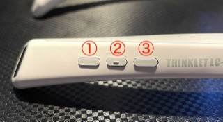
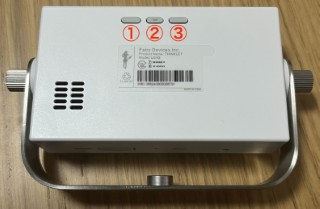

# THINKLET向けサンプル

> [!NOTE]
> SDK自体は、Androidでも動作しますが、  
> 本サンプルは、THINKLET向けのSDKを利用してますので、THINKLETのみインストール・実行可能です。

## サンプルのデバッグインストール
[導入手順](../README.md#導入手順) の設定完了後、プロジェクトルートで下記を実行してください。  
また、アプリ操作には `scrcpy` を用いてください。

```sh
# デバッグビルド＋インストール
./gradlew :sample-thinklet:installDebug
# アプリ起動
adb shell am start -n ai.fd.mimi.sample.thinklet/.MainActivity
```

### サンプルの実行

| THINKLET                 | THINKLET Cube            |
| ------------------------ | ------------------------ |
|  |  |

| Button | Description                                                                                         |
| :----: | :-------------------------------------------------------------------------------------------------- |
|  (1)   | Httpで音声認識。クリックして録音開始・再度クリックしたら停止して認識します。                        |
|  (2)   | WebSocketで音声認識。クリックして録音開始・再度クリックしたら停止します。リアルタイムに認識します。 |
|  (3)   | (1) or (2) の最新の結果を音声認識結果を音声合成して、再生します。                                   |
